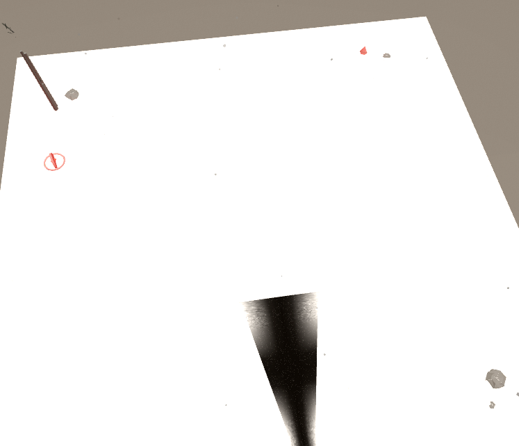

# 🐍 贪吃蛇 Snake Game

一个经典的贪吃蛇游戏，使用 HTML5 Canvas 构建。

## 特性

- 流畅的动画效果和渐变色彩
- 键盘方向键 / WASD 控制
- 移动端触屏滑动和按钮控制
- 穿墙机制
- 分数记录（本地存储最高分）
- 暂停/继续功能

## 如何游玩

直接在浏览器中打开 `index.html` 即可。

- **方向键 / WASD**: 控制蛇的移动方向
- **空格 / ESC**: 暂停/继续
- **点击按钮**: 移动端方向按钮

## 预览

## 技术栈

- HTML5 Canvas
- CSS3 (渐变、阴影、响应式)
- 原生 JavaScript
